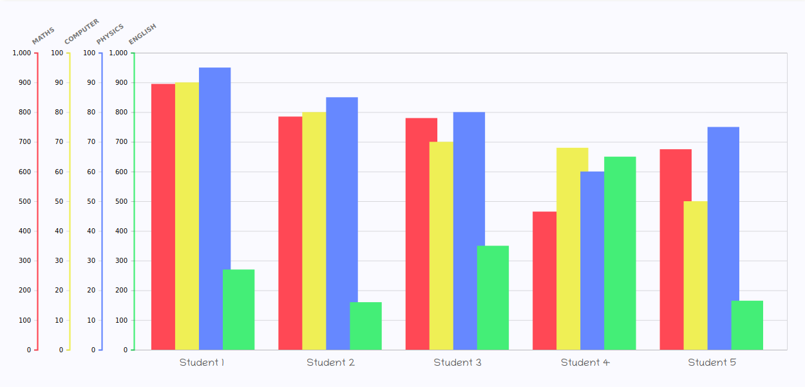

# *A Walk-through for adding custom data visualisation plugins to Apache Superset*

## **Knowledge of following is required before starting with the plugins.**
- Intermediate Javascript
- Basic React
- Basic Python
- A javascript Charting Library - This walkthrough uses [D3.js](https://d3js.org/) as it gives a lot of control over our visualisation.
***
## **Setup development environment**
Here's a list of repositories that contain Superset-related packages:
+ [apache/incubator-superset](https://github.com/apache/incubator-superset) is the main repository containing the apache-superset Python package distributed on pypi. This repository also includes Superset's main TypeScript/JavaScript bundles and react apps under the superset-frontend folder.
+ [apache-superset/superset-ui](https://github.com/apache-superset/superset-ui) contains core Superset's npm packages. These packages are shared across the React apps in the main repository, and in visualization plugins.
+ [apache-superset/superset-ui-plugins-template](https://github.com/apache-superset/superset-ui-plugins-template) can be used with storybook for developing custom plugins.

Clone these repositories and follow the instructions:
+ incubator-superset : [https://github.com/apache/incubator-superset/blob/master/CONTRIBUTING.md#setup-local-environment-for-development](https://github.com/apache/incubator-superset/blob/master/CONTRIBUTING.md#setup-local-environment-for-development)
+ superset-ui : [https://github.com/apache-superset/superset-ui/blob/master/CONTRIBUTING.md](https://github.com/apache-superset/superset-ui/blob/master/CONTRIBUTING.md)
+ superset-ui-plugins-template :
```
cd superset-ui-plugins-template
yarn install
yarn build
yarn storybook
```

***
## **Starting development server**

1) Open **superset-ui** in terminal and run: (if any changes are made in this folder)
```sh
#If changes are made in this folder
yarn build
```
2) Open **incubator-superset** in terminal and run:
(Keep this terminal running in background)
```sh
#activate python virtual environment
source venv/bin/activate

#start the flask server
FLASK_ENV=development superset run -p 8088 --with-threads --reload --debugger
```

3) Open **incubator-superset/superset frontend** in a new terminal and run:
```sh
npm link ../../superset-ui/plugins/[PLUGIN NAME]
npm run dev-server
```
The development server will be started on port 9000
***
## **Understanding the repositories and folder structures**
*Only the required files and folders are discussed*

+ [superset-ui/plugins](https://github.com/apache-superset/superset-ui/tree/master/plugins) : The legacy plugins are described in this folder.
+ [incubator-superset/superset-frontend/src/visualizations/presets](https://github.com/apache/incubator-superset/blob/master/superset-frontend/src/visualizations/presets) : Some plugins are described in this folder. Custom plugins can be added in this folder or along with the legacy plugins.
+ [incubator-superset/superset-frontend/src/visualizations/presets/MainPreset.js](https://github.com/apache/incubator-superset/blob/master/superset-frontend/src/visualizations/presets/MainPreset.js) : The MainPreset.js file configures and initializes the plugins. A unique key is given to each chart plugin.
```javascript
import { Preset } from '@superset-ui/core';

// imported from supeset-ui folder
import ParallelCoordinatesChartPlugin from '@superset-ui/legacy-plugin-chart-parallel-coordinates';
// imported from ../preset folder
import TimeTableChartPlugin from '../TimeTable/TimeTableChartPlugin';

export default class MainPreset extends Preset {
  constructor() {
    super({
      name: 'Legacy charts',
      presets: [new DeckGLChartPreset()],
      plugins: [
        new ParallelCoordinatesChartPlugin().configure({ key: 'para' }), // Unique key given to each plugin
        new TimeTableChartPlugin().configure({ key: 'time_table' }),
      ],
    });
  }
}
```
+ [incubator-superset/superset/viz.py](https://github.com/apache/incubator-superset/blob/master/superset/viz.py) : Contains views for different chart plugins which are identified by the key provided in MainPreset.js. Checks the data recieved from the superset form and can be used to display error messages if the conditions are not met.
```python
# View for parallel coordinates chart plugin
class ParallelCoordinatesViz(BaseViz):

# view is identified using the viz_type, which is same as key from MainPreset.js file
    viz_type = "para"
    verbose_name = _("Parallel Coordinates")
    credits = (
        '<a href="https://syntagmatic.github.io/parallel-coordinates/">'
        "Syntagmatic's library</a>"
    )
    is_timeseries = False

    def query_obj(self) -> QueryObjectDict:
        d = super().query_obj()
        fd = self.form_data
        d["groupby"] = [fd.get("series")]
        return d

    def get_data(self, df: pd.DataFrame) -> VizData:
        return df.to_dict(orient="records")
```
***
## **Understanding the Chart Plugins**
A plugin usually contain following files ( *For example the corresponding files of parallel coordinate plugin are linked* ) - 
1. **[package.json](https://github.com/apache-superset/superset-ui/blob/master/plugins/legacy-plugin-chart-parallel-coordinates/package.json)** : This file specifies all the requirements/dependencies and is used to install required  libraries using `npm install`
2. **[src / controlPanel.ts](https://github.com/apache-superset/superset-ui/blob/master/plugins/legacy-plugin-chart-parallel-coordinates/src/controlPanel.ts)** : This file specifies the structure of the form displayed on the left of chart in Superset.
    + *controlPanelSections* : An array of objects where each object defines a tab of form.
    + *controlSetRows* : An array of arrays where each array specifies one row in form.
    + An input method can be described as an object with following options -
        + name : This name in snake-case is used to identify it in transform props.js file.
        + config : Object which specifies its behaviour
            + label : This name is displayed in form
            + renderTrigger : true if chart is re-rendered when value is changed.
            + type : specifies the type of input. Eg- SelectControl,CheckBoxControl,TextControl
            + default : specifies default value of input.

        ```typescript
        // Snippet from controlPanel.ts file for a bar chart
        import { t } from '@superset-ui/translation';
        import { formatSelectOptions } from '@superset-ui/control-utils';

        export default {
            requiresTime: true, 
            controlPanelSections: [   // describes sections of form
            {
              label: t('Query'),      // section name
              expanded: true,
              controlSetRows: [       // describes different input rows
                ['series'],           // these are pre-defined inputs
                ['metrics'],          // each array represents one row
                ['adhoc_filters'],
                ['row_limit'],
              ],
            },
            {
              label: t('Chart Options'),
              expanded: true,
              controlSetRows: [
                ['color_scheme','label_colors'],  //  provides color scheme
                [

              // the name : "show_legend" is used to identify the Input in 
              // transformProps. Name is used in camel case "showLegend" to 
              // identify in  .transformProps.js file

                  {                              // self defined input
                    name: 'show_legend',         // chack box to display legend
                    config: {
                      type: 'CheckboxControl',
                      label: t('Legend'),
                      default: true,
                      renderTrigger: true,      // render the chart on change
                      description: t('Whether to display the Legend'),
                    },
                  },
                ],
                [
                   {
                     name: 'sort_bars',  // drop down to select ascending,descending or default sorting
                     config: {
                       label: t('Sort Bars'),
                       renderTrigger: true,
                       clearable: false,
                       type: 'SelectControl',
                       choices: (['auto','ascending','descending']),
                       default: 'auto',
                       description: t('Whether and how to Sort Bars cooresponding to first metric ecified'),
                     },
                   },
                ],
              ],
            },
            {
                label: t('X Axis'),
                expanded: true,
                controlSetRows: [
                    [
                      {
                        name: 'x_axis_label',  // Text input to describe label
                        config: {
                            type: 'TextControl',
                            label: t('X Axis Label'),
                            renderTrigger: true,
                            default: '',
                        },
                      },
                    ],
                ],
            },
          ],
        };
        ```

3. **[src / transformProps.js](https://github.com/apache-superset/superset-ui/blob/master/plugins/legacy-plugin-chart-parallel-coordinates/src/transformProps.js)** : In superset the Visualzation are contained in SuperChart react component and the data is passed as chartProps to the component as follows.
    ```html
    <SuperChart
      chartType="calendar"
      width={600}
      height={600}
      formData={...}
      queryData={{
        data: {...},
      }}
    />
    ```
This process is handled by the superset itself when a chart is created. The transformProps.js file takes data from these ChartProps and converts it to required form and passes it to demoChart.js file where it can be used to make the visualization.

*Note - The data from a particular input in form is identified by the name given in controlPanel.ts file. The snake-case name in controlPanel.ts file has to be tansformed to camel-case while refering to it in tranformProps.js.* 

4. **[src / Chart.js](https://github.com/apache-superset/superset-ui/blob/master/plugins/legacy-plugin-chart-parallel-coordinates/src/ParallelCoordinates.js)** : This is the main file which contains the d3.js code and generates the visualization. This can be broken into many seperate files for each component.


5. **[src / ReactChart.js](https://github.com/apache-superset/superset-ui/blob/master/plugins/legacy-plugin-chart-parallel-coordinates/src/ReactParallelCoordinates.js)**


6. **[src / index.js](https://github.com/apache-superset/superset-ui/blob/master/plugins/legacy-plugin-chart-parallel-coordinates/src/index.js)** : This is the file which links the transformProps.js, controlPanel.ts and the Chart.js file and Exports the ChartPlugin. It also specifies the metadata of the chart i.e. thumbnail, name and description.

7. CSS files and images folder having thumbnail for the visualization.

---
## **Using Storybook**
[StoryBook](https://github.com/apache-superset/superset-ui-plugins-template/tree/master/packages/superset-ui-plugins-demo) can be used to create plugins and see the changes in visualizations as we they are made. There is no need to build the plugin again and again after every change.

Steps to integrate a plugin with storybook -
+ Copy the plugin in the superset-ui-plugins-template/packages folder.
+ In superset-ui-plugins-template/package/superset-ui-plugins-demo/storybook/stories/[index.js](https://github.com/apache-superset/superset-ui-plugins-template/blob/master/packages/superset-ui-plugins-demo/storybook/stories/plugin-chart-dummy/index.js) file import the plugin and configure it with a unique key.
```javascript
// For example, If our plugin name is My-Plugin
import NewPlugin from '../../../../My-Plugin/src';
new NewPlugin().configure({ key: 'my_plugin' }).register();
```
+ In superset-ui-plugins-template/package/superset-ui-plugins-demo/storybook/stories/[stories.tsx](https://github.com/apache-superset/superset-ui-plugins-template/blob/master/packages/superset-ui-plugins-demo/storybook/stories/plugin-chart-dummy/Stories.tsx) file change the SuperChart components props as you require in accordance with your controlPanel.ts file.
```html
<!-- As an example, for My-Plugin -->
 <SuperChart
        chartType="my_plugin"
        width={1100}
        height={500}
        queryData={{ data }}
        formData={{
          linearcolorScheme: 'd3Category10',
          showDatatable:false,
          includeSeries: true,
          metrics:["A","B","C"],
          series:["D"],
          secondaryMetric:null,
        }}
      />
<!-- data comes from the data.ts file -->
<!-- formData depends on the cotrolPanel.js file and the input names and types described in it. -->
```
+ Sample data can be passed using the [data.ts](https://github.com/apache-superset/superset-ui-plugins-template/blob/master/packages/superset-ui-plugins-demo/storybook/stories/plugin-chart-dummy/data.ts) file which can be edited to export data in required format. Usually **the data is an array of object where each object represents a column in data table** and keys are columns of the table.

### **Run Storybook**
run the following commands in story  :
```sh
cd superset-ui-plugins-template

#executed if any new plugins have been added
yarn build

yarn storybook
```
Storybook serber is started on PORT 9001. Now the changes made to the plugins can be seen instantly.
***
## **Integrating the plugins to superset**
- Adding the plugin.
  - Adding the plugin with legacy plugins in superset-ui/[plugins](https://github.com/apache-superset/superset-ui/tree/master/plugins) folder - Add the plugin folder in the plugins folder same as explined in the plugin structure section.
  - Adding the plugin in incubator-superset/superset-frontend/src/[visualizations](https://github.com/apache/incubator-superset/tree/master/superset-frontend/src/visualizations) folder - Add the plugin folder (only the files present in the src folder) in the visualization folder.

- Import and configure the plugin in the [MainPreset](https://github.com/apache/incubator-superset/blob/master/superset-frontend/src/visualizations/presets/MainPreset.js).js file. Import the plugin based on the folder where the plugin is added. For reference see the parallele-coordinates plugins and Filter-Box plugin.

- Add the view for the Chart in the [viz.py](https://github.com/apache/incubator-superset/blob/master/superset/viz.py) file. Give the **viz_type** of view same as the key given in MainPreset.js file. 

- Run the dev-server to see the changes.

***
## **A simplified example of a visualization file with explainatory comments : [VariableScaleBarChart.js](./superset/assets/src/visualizations/VariableScaleBarChart/VariableScaleBarChart.js)**

```javascript
// This file doesn't include code for some extra featres like XTicksLayout, barValueLayout, option to display Legend etc.
// To see the original file go to the link provided in the Heading above

import d3 from 'd3';                  // D3 version3 is imported by default
import PropTypes from 'prop-types';
import './styles.css';                // link to css file
import { CategoricalColorNamespace } from '@superset-ui/color';  // used to choose colorScheme

const propTypes = {
  // Standard tabular data [{ fieldName1: value1, fieldName2: value2 }]
  width: PropTypes.number,
  height: PropTypes.number,
  data: PropTypes.arrayOf(PropTypes.object),
  colorScheme: PropTypes.string,
  metrics: PropTypes.arrayOf(PropTypes.string),
  series: PropTypes.string,
  showLegend: PropTypes.bool,
  showBarValues: PropTypes.bool,
  sortBars: PropTypes.string,
  xAxisLabel: PropTypes.string,
  bottomMargin: PropTypes.number,
  xTicksLayout: PropTypes.string,
  barValuePrecision: PropTypes.number,
};

const TIME_SHIFT_PATTERN = /\d+ \w+ offset/;
const { getColor } = CategoricalColorNamespace;

// used to identify the categorical color scheme
function cleanColorInput(value) {
    // for superset series that should have the same color
    return String(value)
      .trim()
      .replace(' (right axis)', '')
      .split(', ')
      .filter(k => !TIME_SHIFT_PATTERN.test(k))
      .join(', ');
  }

// The exported Chart function
function VariableScale(element,props){
    const{ 
        series,       // Data from transformProps.js
        data,         // provided through chart props
        metrics,
        sortBars,
        xAxisLabel,   // CamelCase names from controlPanel.ts
        bottomMargin,
        showLegend,
        showBarValues,
        colorScheme,
        xTicksLayout,
        barValueLayout,
        barValuePrecision
    } = props;

    let innerwidth = 0,
        innerheight = 0,
        singleAxisWidth = 40,
        axisWidth,
        graphWidth,
        entryWidth,
        barWidth,
        yScale,
        yAxis,
        entries = 0,
        rAngle = 0,
        bAngle = 0;

    let color = ["#e8a92c","#6e63c2","#f0ec1d","#950cad","#3bbad4","#38f2ff","#d1ce0d"];
    // the colorScale according to the colorScheme chosen
    const colorScale = (d) => getColor(cleanColorInput(d), colorScheme);

    const container = d3.select(element).attr("id","my-svg"),
          svg = container.append("svg").attr("width","100%").attr("height","100%"),
          margin = { top: 100, bottom: bottomMargin === "auto" ? 100 : parseInt(bottomMargin), left:2, right:30 };

    let data1 = [];
    for(let i =0 ; i < data.length ; i++ ){
        data1.push(data[i]);
    }

    render();

    // functions
    function render(){
        svg.selectAll("g").remove();    // remove all current g before re-rendering
        let GraphG = svg.append('g');
        
        // sorting data according to options chosen
        if(sortBars === "auto"){
            data1 = data;
        }
        else if(sortBars === "ascending"){
            data1.sort(function(a,b){
                return (parseInt(a[metrics[0]]) - parseInt(b[metrics[0]]) );
            });
        }
        else if(sortBars === "descending"){
            data1.sort(function(a,b){
                return (parseInt(b[metrics[0]]) - parseInt(a[metrics[0]]) );
            });
        }

        innerheight = parseInt(svg.style('height')) - margin.top - margin.bottom;
        innerwidth = parseInt(svg.style('width')) - margin.left - margin.right;
        entries = data1.length;

        axisWidth = singleAxisWidth * metrics.length + 26;
        graphWidth = innerwidth - axisWidth;
        entryWidth = graphWidth/entries;
        barWidth = (entryWidth*8/9) / metrics.length;

        let LinearScale = []; // Array of scale for each metric
        let dMax = [];        // contains max value of each metric chosen
        metrics.forEach((col) => {
            let val = d3.max( data1.map((d) => d[col]));
            let k = 0.001;
            while(k < val)      // max value is either a multiple of 10
                k *= 10;        // or 5 * multiple of 10
            if( k > 2*val)      // i.e 1,5,10,50,100,500,1000....
                k /= 2;
            dMax.push(k);
        });

        // appending Axes
        for(let m = 0 ; m < metrics.length ; m++ ){
            yScale = d3.scale.linear().domain([0,dMax[m]]).range([innerheight,0]); // defining scale for mth metric
            LinearScale.push(yScale);
            yAxis = d3.svg.axis().scale(yScale).orient('left')
                          .tickPadding(4).ticks(10).tickSize(5)
                          .tickFormat(dMax[m] < 10 ? d3.format("") : d3.format(".2s") );

            let axisG = GraphG.append('g')      // container for mth y-axis
                            .classed('my-axis',true)
                            .attr('id',`axis${m}`);

            axisG.call(yAxis)
            .attr('transform',`translate(${margin.left + 12 + singleAxisWidth * (m+1)},${margin.top})`);
            axisG.select("path")
                .style("stroke",colorScale(metrics[m]) || color[m])
                .style("stroke-width",2.75)
                .style('fill','none');
            
            // Append Y Axis Labels for mth y-axis
            axisG.append('text')
            .text(`${metrics[m].toUpperCase()}`)
            .attr('fill','#777777')
            .attr('y','-37')
            .attr('transform',`rotate(-30,${margin.left + singleAxisWidth},${margin.top -150})`)
            .attr('text-anchor','start')
            .attr('x','-15')
            .attr('font-weight','800')
            .attr('font-size','10');
        }
        
        // Appending Bars of barchart
        d3.selectAll("rect").remove();  // befor re-rendering delete all existing Bars

        for(let j = 0 ; j < metrics.length ; j++ ){
            svg.append("g").selectAll("rect").data(data1).enter().append("rect") // bars of each metric(same color) in seperate <g> tag 
            .style("fill", colorScale(metrics[j]) || color[j])     // use the colorScheme from props if available or use default colors
            .attr("x",(d,i) => axisWidth+(barWidth)*j+(entryWidth*i) )
            .attr("width",barWidth)
            .attr("y",(d) => margin.top + LinearScale[j](d[metrics[j]]) )       // y coordinate of top of each bar 
            .attr("height",(d) => innerheight - LinearScale[j](d[metrics[j]])); // height extends downwards from (x,y) point
        }

        // Appending X-Axis Ticks
        svg.append("g").selectAll("text").data(data1)
            .enter().append("text")
            .classed("x-label",true)
            .text((d,i) => d[series])
            .attr("y",(d,i) => innerheight + margin.top + 18 )
            .attr("x",(d,i) => axisWidth + entryWidth*i + entryWidth*4/9)
            .style("fill","#555555")
            .attr("text-anchor",xTicksLayout === "45°" ? "start" : "middle")
            .attr("transform",(d,i) => `rotate(${rAngle},${axisWidth + entryWidth*i},${innerheight + margin.top})`); // rotates tick by rAngle degrees

        // Adding X axis label if true
        if(xAxisLabel !== ""){    // If X axis Label is not empty string
            svg.append("g").append("text")
                .text(xAxisLabel)
                .attr("text-anchor","middle")
                .attr("transform", "translate(" + (innerwidth/2) + ", " + (margin.top+innerheight+60) + ")")
        }
    }
}

VariableScale.displayName = 'Variable Scale BarChart';
VariableScale.propTypes = propTypes;

export default VariableScale;
```
